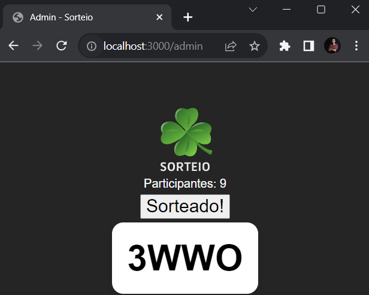
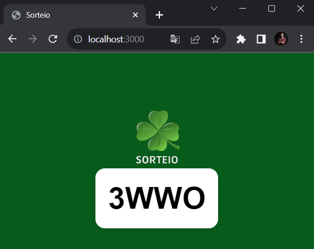
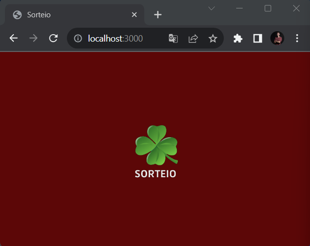

# Sorteio Com Websocket 

Uma aplicação simples de sorteio em tempo real utilizando WebSockets.

## Descrição

Esta aplicação consiste em duas partes principais:

1. **Admin**: Uma interface para realizar o sorteio e visualizar a quantidade de participantes conectados.
2. **Cliente**: Uma interface para os usuários se conectarem e participarem do sorteio. Quando o sorteio é realizado, a interface do cliente muda de cor e mostra um código se o usuário ganhar.

## Tecnologias Utilizadas

- **Node.js** para o backend.
- **Express** para servir a aplicação web.
- **WebSocket** para comunicação em tempo real entre o servidor e os clientes.

4.**Configuração do WebSocket**

Para habilitar a comunicação em tempo real, usamos WebSockets. O servidor `server.js` cuida de aceitar conexões de clientes e admin. A lógica de sorteio e comunicação de resultados é tratada aqui.

- `client.js`: Cada cliente conecta-se ao servidor usando WebSockets. Eles recebem atualizações em tempo real quando um sorteio é realizado.
- `admin.js`: A interface do administrador se conecta ao servidor como um cliente especial. A partir daqui, o admin pode iniciar um sorteio.

## **Como Executar o Sorteio**

- Abra a página de administração em `http://localhost:3000/admin`.
- Verifique quantos clientes estão conectados através do contador de participantes.
- Clique no botão "Realizar Sorteio" para iniciar o sorteio. Um código de confirmação será gerado.
- Todos os clientes receberão o resultado em tempo real. O vencedor verá o código de confirmação em sua tela.

## **Telas**

    
    
    

    ---
